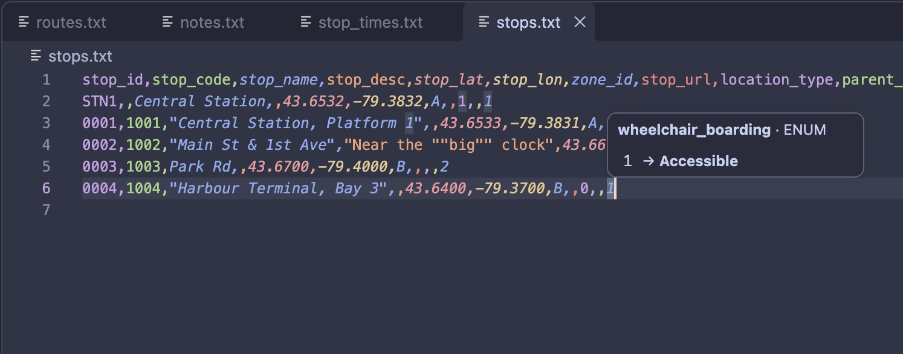

# GTFS

Language support for [GTFS](https://gtfs.org/documentation/schedule/reference/) transit feed files in VS Code: rainbow columns, plus hovers that explain each column and code.

An unaffiliated community-built extension 🚌

## Features

- Rainbow columns - each column in a GTFS file gets its own colour, making files like `stops.txt` easier to read.
- Works automatically on standard GTFS file names (`agency.txt`, `stops.txt`, ...).
- Colours come from your current theme.
- Hover a cell to see its column's type, whether it's required, and its label, e.g. `route_type` `3` → **Bus**.
- Hover a header to list all codes for that column.
- Light checks for common mistakes, like unknown codes or badly formatted times. For full validation, use [MobilityData's GTFS Validator](https://gtfs-validator.mobilitydata.org/).

## Notes

- Large files (e.g. a 200 MB `stop_times.txt`) may open with highlighting disabled - a limit set by VS Code for big files.
- Highlighting applies to files by name, so any file called e.g. `stops.txt` is treated as GTFS.

## Roadmap

- Jump from an ID (e.g. `stop_id` in `stop_times.txt`) to its row in the referenced file

## Credits

Hover information and checks come from a bundled copy of [MobilityData's machine-readable GTFS schema](https://github.com/MobilityData/gtfs-garage) (Apache-2.0, see [schema/NOTICE](schema/NOTICE)). It isn't the specification itself. For the authoritative definitions see the [GTFS Schedule reference](https://gtfs.org/documentation/schedule/reference/).

Inspired by [Rainbow CSV](https://marketplace.visualstudio.com/items?itemName=mechatroner.rainbow-csv).
